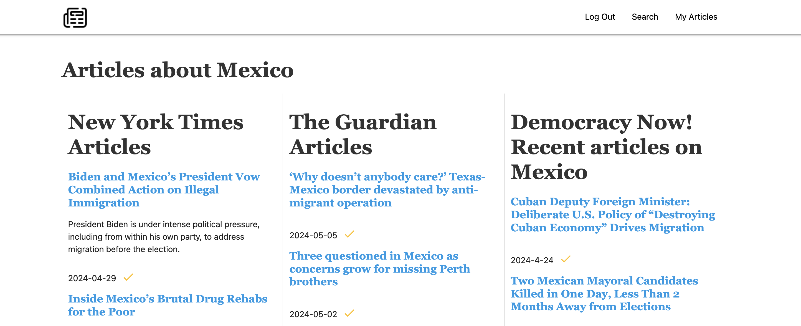

# <InfoStream>

This is an application to search for news articles in 3 different newspapers simoultaneosuly. It is meant to be a tool to get a more rounded view of a particular topic.
It pulls information from the API's of The New York Times and The Guardian, and a simple scraper from the Democracy Now! website. 

# Screenshot

# Technologies Used

- Django
- PostgreSQL
- Python
- Javascript
- CSS, HTML
- Heroku
- Materialize

# Getting Started

[Click to use InfoStream](https://infostream-5ca2b2b57324.herokuapp.com/)

# Next Steps

- Add pop-up feature to preview the article
- Add a feature to read articles side by side
